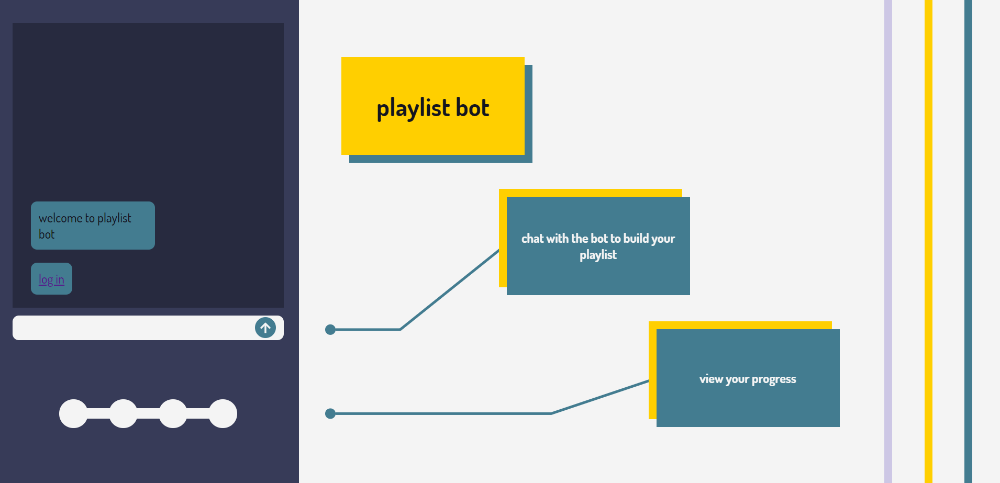
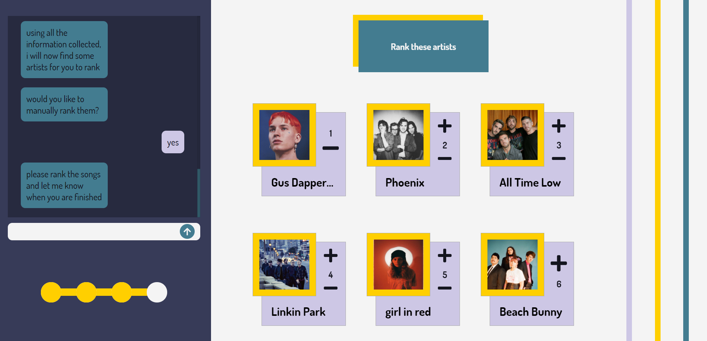
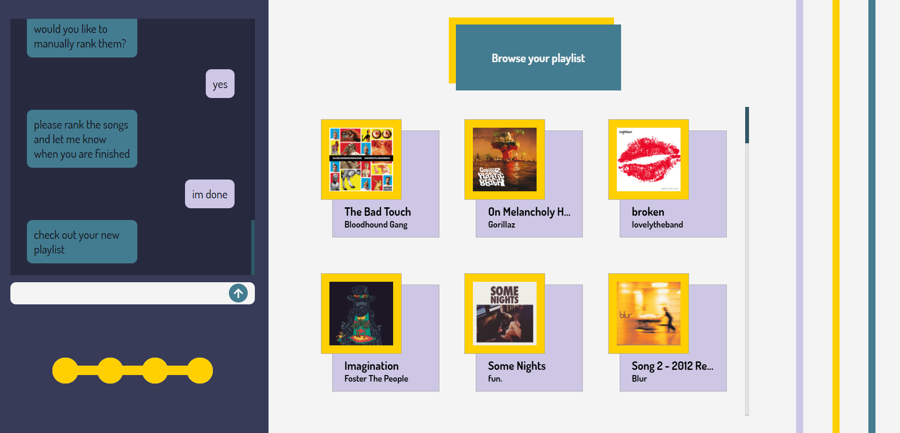

# Playlist Bot

This project was created during TAMUmake 2021

## Description

A problem music listeners often face is branching out to find new music. By combining an easy to use platform and recommendation algorithms, the playlist bot brings a solution to this problem. By answering various questions, the application learns about the user's music needs and taste, and ultimately builds a Spotify playlist for them.

## Tech-Stack

- Frontend: <a href="https://reactjs.org/">ReactJS</a>
- Backend: <a href="https://flask.palletsprojects.com/en/1.1.x/">Flask</a>
- NLU: <a href="https://rasa.com/">Rasa</a>
- Services: <a href="https://developer.spotify.com/documentation/web-api/">Spotify Web API</a>

## Screenshot Demo

